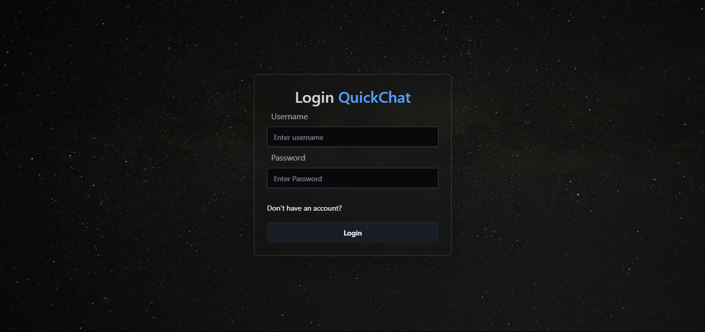

# 💬 Quick Chat

A real-time chat application built with **React.js, Node.js, Express, MongoDB, Socket.io**, styled using **TailwindCSS** and **DaisyUI**. This project demonstrates modern full-stack development with real-time capabilities, authentication, and a sleek responsive UI.

## 🚀 Tech Stack

- **Frontend**: React.js, TailwindCSS, DaisyUI
- **Backend**: Node.js, Express.js, MongoDB, Mongoose
- **Real-Time**: Socket.io
- **Authentication**: JWT, bcrypt

## 🌟 Features

- 🔒 Secure user authentication & authorization (JWT + bcrypt)
- 💬 Real-time instant messaging via Socket.io
- 👀 Online/offline user status tracking
- 📱 Fully responsive UI with TailwindCSS + DaisyUI
- 🧠 React Context API for managing global app state
- ⚙️ Robust error handling on both frontend and backend

## 📸 Demo

> 🔗 [Live Demo](https://quickchat-qv8k.onrender.com/)  
> 📂 [Source Code](https://github.com/dhaval-patil)

| Login Page | Chat Room |
|------------|-----------|
|  |  |

## 📁 Project Structure

```
quick-chat/
├── client/
│   ├── src/
│   │   ├── components/
│   │   ├── context/
│   │   ├── pages/
│   │   └── App.jsx
│   └── tailwind.config.js
├── server/
│   ├── config/
│   ├── controllers/
│   ├── models/
│   ├── routes/
│   ├── socket.js
│   └── server.js
└── README.md
```

## 🔧 Getting Started

### Prerequisites

- Node.js & npm
- MongoDB (local or Atlas)

### 1. Clone the Repository

```bash
git clone https://github.com/yourusername/quick-chat.git
cd quick-chat
```

### 2. Backend Setup

```bash
cd server
npm install
```

Create a `.env` file inside the server directory:

```env
PORT=5000
MONGO_URI=your_mongodb_connection_string
JWT_SECRET=your_jwt_secret
```

Run the server:

```bash
node server.js
```

### 3. Frontend Setup

```bash
cd client
npm install
npm run dev
```

Visit the app at: `http://localhost:5173`

## 🧪 Future Enhancements

- ✅ Emoji support
- ✅ Message timestamps
- ⏳ Media (image/file) sharing
- ⏳ Notifications
- ⏳ Typing indicators

## 🙋‍♂️ Author

**Dhaval Patil**  
🔗 [LinkedIn](https://www.linkedin.com/in/dhaval-patill/)

## ⭐️ Show Some Love

If you found this project helpful or interesting, please give it a ⭐️ and share it!
